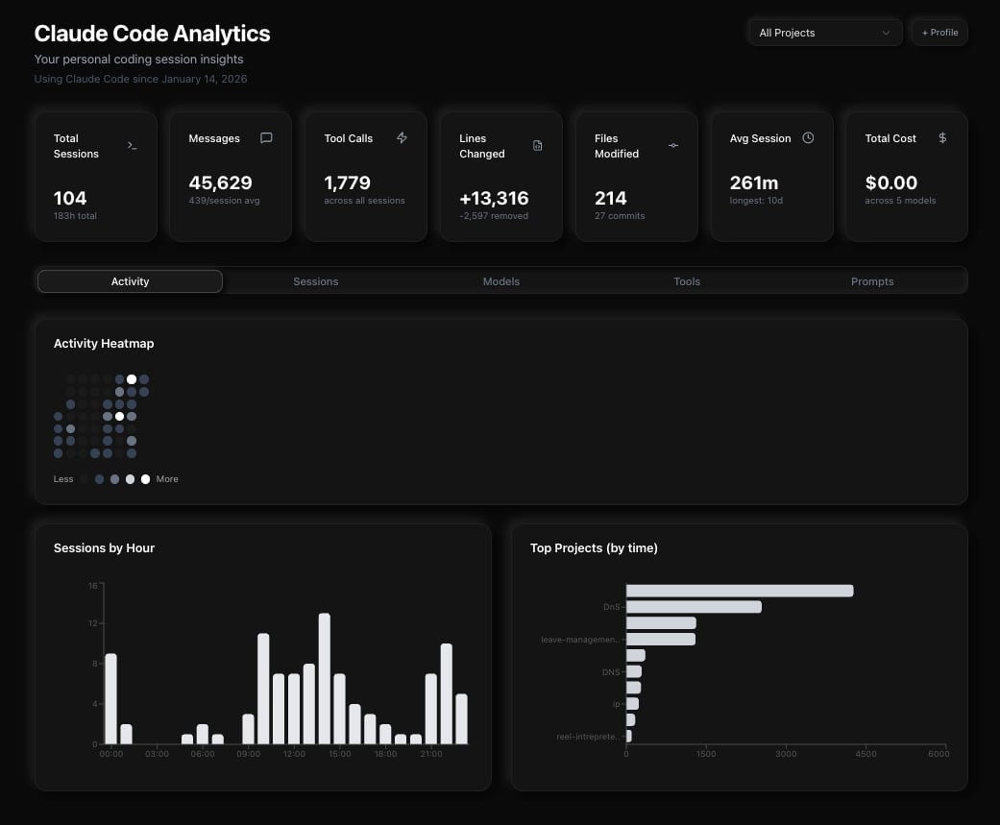

# Claude Code Analytics

A personal analytics dashboard for [Claude Code](https://claude.ai/claude-code) sessions. Visualize your coding patterns, model usage, tool calls, spending, and prompt history — all from the data Claude Code stores locally on your machine.

**Your data never leaves your browser.** The hosted version processes everything client-side.



## Features

- **Activity Heatmap** — GitHub-style contribution grid showing daily message activity
- **Session Explorer** — Browse all sessions with expandable message threads
- **Model Breakdown** — Pie chart + bar chart + token table with cost per model
- **Daily Token Usage** — Stacked area chart showing token consumption over time
- **Cost Tracking** — Total spending across all models with per-model breakdown
- **Tool Usage** — See which tools (Read, Edit, Bash, etc.) you use most
- **Prompt History** — Searchable, clickable prompt log with copy-to-clipboard
- **Stats Overview** — 7 clickable cards: sessions, messages, tool calls, lines, files, avg session, total cost
- **Sessions by Hour** — Bar chart of when you code most
- **Top Projects** — Ranked by time spent
- **Multi-Profile** — Upload multiple export files and switch between them
- **Project Filter** — Filter sessions, tools, and prompts by project

## Quick Start

### Local (reads your data directly)

```bash
git clone https://github.com/1shanpanta/claude-analytics.git
cd claude-analytics
npm install   # or: bun install
npm run dev   # or: bun dev
```

Opens at `http://localhost:3000` and auto-loads your `~/.claude/` data.

### Hosted (upload mode)

1. Export your data (no install needed — uses only Node built-ins):

```bash
git clone https://github.com/1shanpanta/claude-analytics.git && cd claude-analytics
node scripts/export.mjs
```

2. Visit the hosted app and drop the generated `claude-analytics-export.json` file.

All processing happens in your browser. Nothing is uploaded to any server.

## How It Works

Claude Code stores session metadata, usage stats, and prompt history locally in `~/.claude/`:

| File | What it contains |
|------|-----------------|
| `~/.claude/stats-cache.json` | Aggregated stats, model usage, daily activity, cost |
| `~/.claude/usage-data/session-meta/*.json` | Per-session metadata (duration, tools, lines, commits) |
| `~/.claude/history.jsonl` | Every prompt you've sent |
| `~/.claude/projects/<id>/<session>.jsonl` | Full conversation messages (local mode only) |
| `~/.claude/projects/<id>/memory/*.md` | Project memory files |

The dashboard reads these files and renders charts + tables. No external APIs, no telemetry.

## Tech Stack

- **Next.js 16** (App Router)
- **React 19**
- **Tailwind CSS 4**
- **shadcn/ui** (Card, Tabs, Badge, ScrollArea, Select)
- **Recharts** (Area, Bar, Pie charts)
- **Lucide Icons**
- **bun** (package manager + runtime)


## License

MIT
